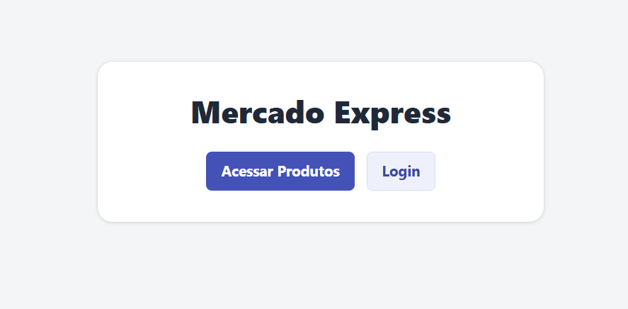
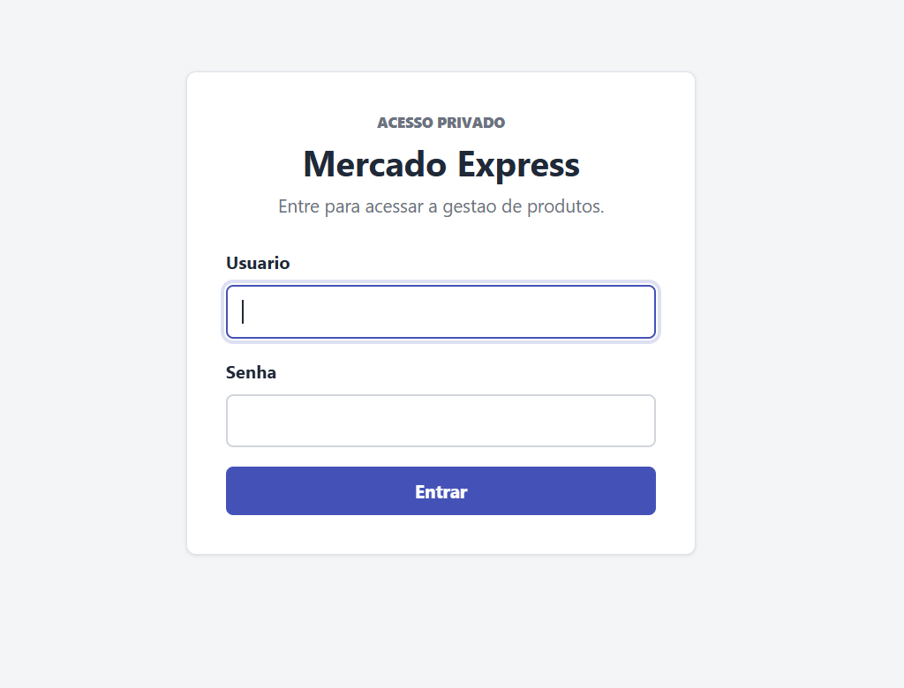
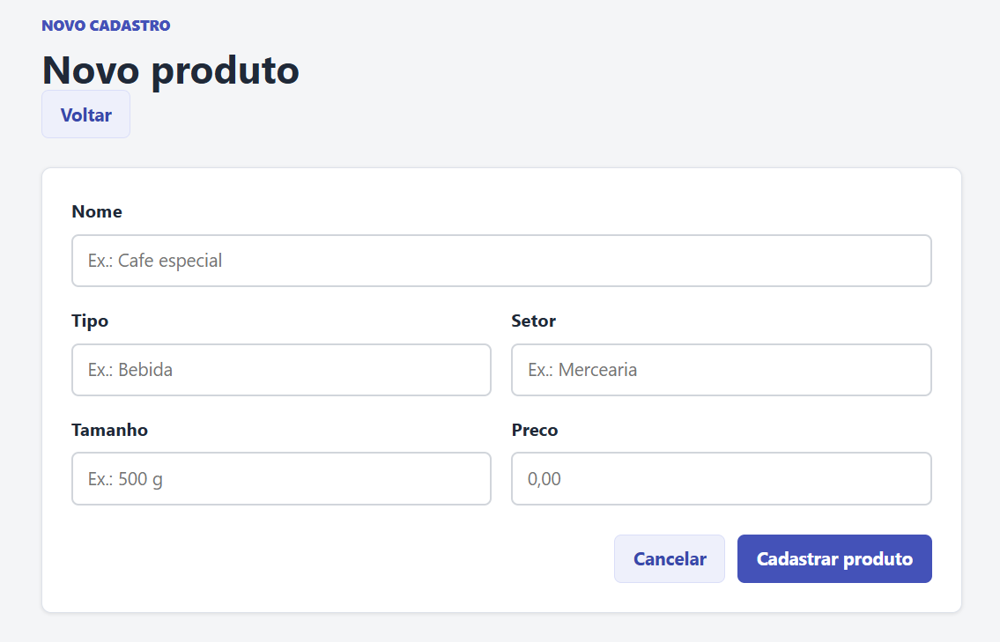
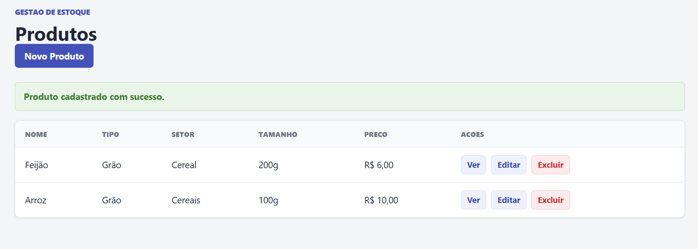
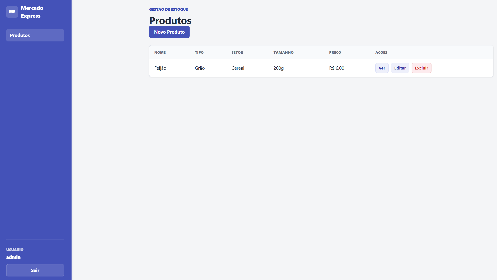
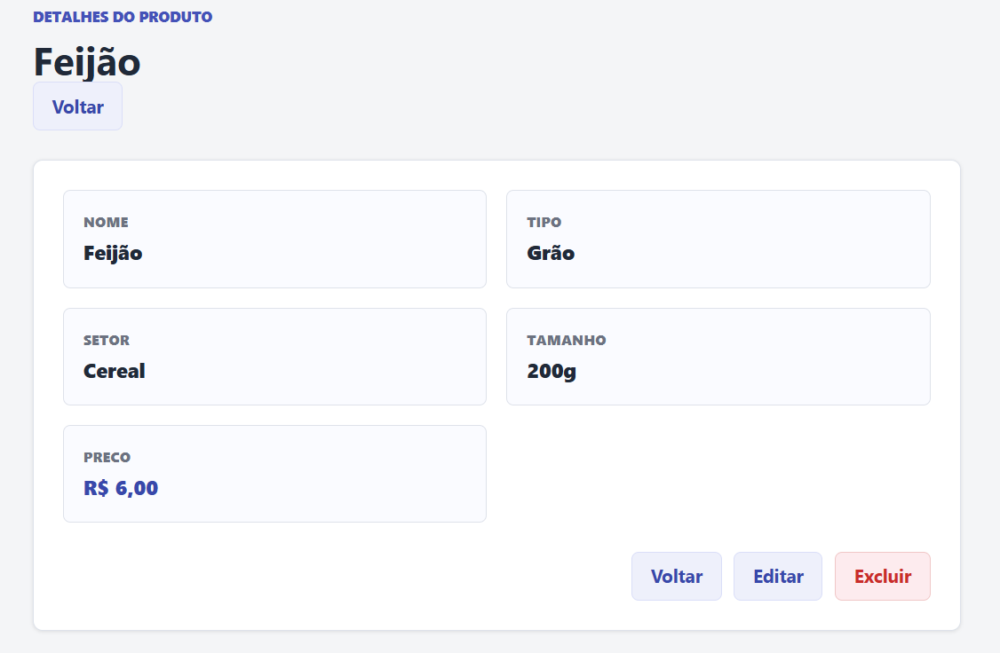
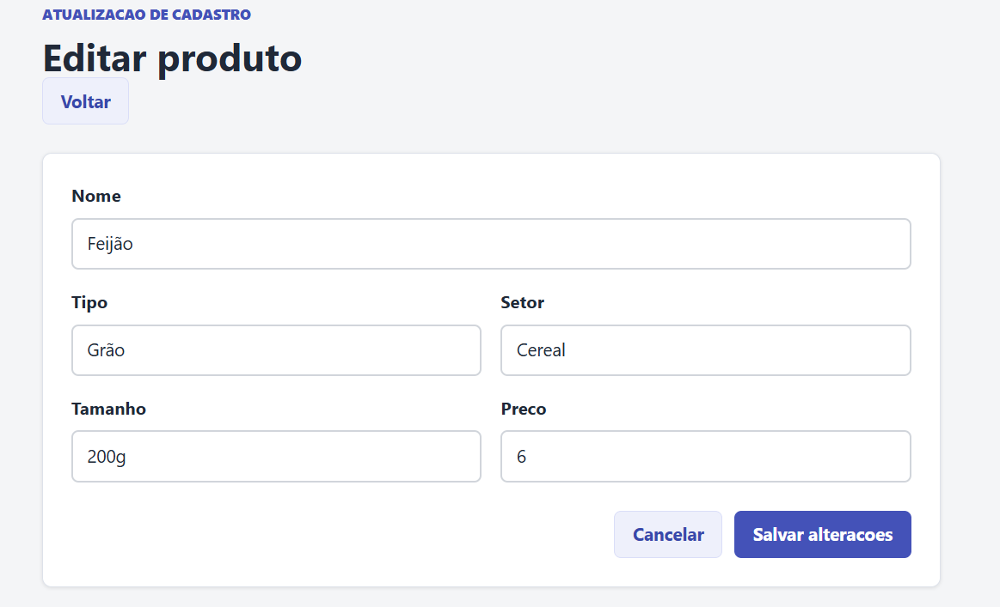
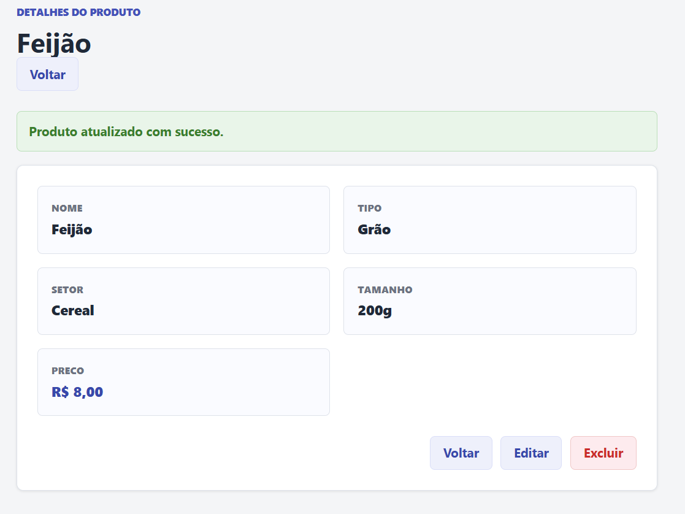
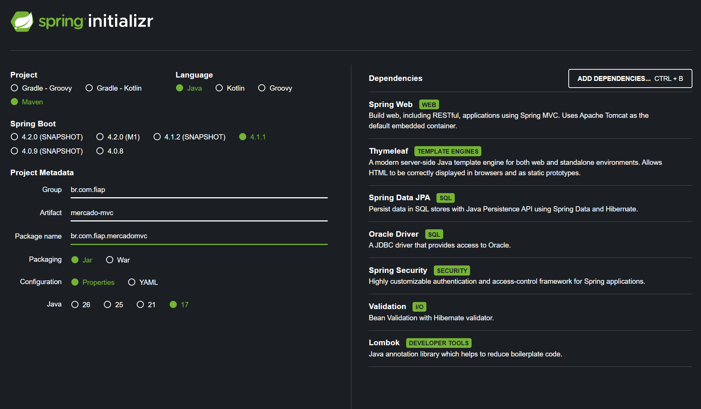

# Mercado Express — Checkpoint 4 Parte II

## Sobre o projeto

Mercado Express é uma aplicação Spring MVC desenvolvida para o **FIAP Java Advanced — Checkpoint 4 Parte II: Spring MVC, Security e Deploy**.

O sistema permite que usuários autenticados gerenciem produtos de mercado por uma interface web renderizada com **Spring MVC + Thymeleaf**. Os dados são persistidos em banco **Oracle** por meio de Spring Data JPA, e as rotas privadas são protegidas com Spring Security.

## Requisitos

- Spring Boot 4.1.1
- Maven
- Java 17
- Spring MVC com `@Controller`
- Thymeleaf
- CRUD web completo
- Persistência em Oracle
- Spring Security com rotas públicas e privadas
- Lombok
- Bean Validation
- Projeto preparado para deploy com Docker no Render
- API REST adicional com DTOs, validação, tratamento de erros e HATEOAS

A API REST/HATEOAS é uma funcionalidade adicional para demonstrar conceitos praticados na Parte I. A entrega principal da Parte II continua sendo a aplicação MVC com Thymeleaf e Spring Security.

## Tecnologias utilizadas

- Java 17
- Spring Boot 4.1.1
- Spring Web MVC
- Thymeleaf
- Spring Data JPA
- Oracle JDBC Driver
- Spring Security
- Spring HATEOAS
- Bean Validation
- Lombok
- Maven
- Docker

## Arquitetura

Fluxo principal da aplicação web:

```text
Browser
   ↓
Spring Security
   ↓
MVC Controller
   ↓
Service
   ↓
Repository
   ↓
Oracle
```

Renderização HTML:

```text
MVC Controller
   ↓
Thymeleaf
   ↓
HTML
```

Fluxo adicional da API REST:

```text
REST Client
   ↓
REST Controller
   ↓
Service
   ↓
Repository
   ↓
Oracle
```

## Banco de dados Oracle

O projeto usa os objetos Oracle definidos em [docs/database/oracle-schema.sql](docs/database/oracle-schema.sql).

Tabela:

```text
TDS_MVC_TB_MERCADO
```

Sequence:

```text
TDS_MVC_SEQ_MERCADO
```

Campos persistidos:

| Campo | Tipo Java | Observação |
| ----- | --------- | ---------- |
| `id` | `Long` | Chave primária gerada pela sequence |
| `nome` | `String` | Obrigatório, até 120 caracteres |
| `tipo` | `String` | Obrigatório, até 50 caracteres |
| `setor` | `String` | Obrigatório, até 80 caracteres |
| `tamanho` | `String` | Obrigatório, até 40 caracteres |
| `preco` | `BigDecimal` | Obrigatório, maior que zero, escala de 2 casas |

A aplicação usa `spring.jpa.hibernate.ddl-auto=validate`, portanto não cria nem altera a estrutura do banco automaticamente.

## Interface Web com Thymeleaf

A rota `/` é pública e apresenta uma página inicial simples com acesso à área de produtos e à tela de login.

<p align="center">
  
</p>
<p align="center">
  <sub>Página inicial pública da aplicação.</sub>
</p>

A interface browser-facing usa templates Thymeleaf em `src/main/resources/templates` e recursos como `th:text`, `th:each`, `th:object`, `th:field`, `th:action`, `th:if` e `th:errors`.

## Segurança com Spring Security

A rota `/login` é pública. As rotas `/mercado/**` são privadas, e usuários não autenticados são redirecionados naturalmente para a tela de login antes de acessar a gestão de produtos.

<p align="center">
  
</p>
<p align="center">
  <sub>Tela pública de autenticação com formulário do Spring Security.</sub>
</p>

Rotas públicas:

- `/`
- `/login`
- assets estáticos em `/css/**`, `/images/**`, `/webjars/**` e `/favicon.ico`
- leitura REST em `GET /api/mercado` e `GET /api/mercado/{id}`

Rotas privadas:

- `/mercado/**`
- mutações REST em `/api/mercado/**`

A autenticação usa login por formulário do Spring Security. O logout é feito por `POST /logout`, com token CSRF nos formulários Thymeleaf.

Credenciais padrão para desenvolvimento local:

```text
Usuário: admin
Senha: fiap123
```
## CRUD

Todas as operações do CRUD usam a tabela `TDS_MVC_TB_MERCADO` por meio do `MercadoService` e `MercadoRepository`.

### CREATE — Novo produto

O usuário acessa **Novo Produto**, preenche o formulário e envia `POST /mercado`. O formulário Thymeleaf recebe `nome`, `tipo`, `setor`, `tamanho` e `preco`, com Bean Validation aplicada aos campos.

<p align="center">
  
</p>
<p align="center">
  <sub>Formulário MVC para cadastro de produto.</sub>
</p>

Após a validação bem-sucedida, o fluxo é:

```text
Controller
→ Service
→ Repository
→ Oracle
```

A interface retorna para a listagem e mostra o estado de sucesso.

<p align="center">
  
</p>
<p align="center">
  <sub>Produto criado e persistido no Oracle.</sub>
</p>

### READ — Listagem de produtos

A listagem aparece em `GET /mercado`. O Thymeleaf renderiza a coleção retornada do Oracle e expõe as ações **Novo Produto**, **Ver**, **Editar** e **Excluir**.

<p align="center">
  
</p>
<p align="center">
  <sub>Lista de produtos renderizada com Thymeleaf.</sub>
</p>

### READ — Detalhes do produto

`GET /mercado/{id}` carrega um único produto e renderiza seus valores através do Thymeleaf.

<p align="center">
  
</p>
<p align="center">
  <sub>Detalhes de um produto carregado pelo ID.</sub>
</p>

### UPDATE — Editar produto

Ao acessar **Editar**, os valores existentes são carregados, o formulário é preenchido e o envio atualiza o mesmo registro Oracle com `PUT /mercado/{id}` usando o filtro de método oculto do Spring MVC.

<p align="center">
  
</p>
<p align="center">
  <sub>Formulário preenchido com os dados atuais do produto.</sub>
</p>

Após a atualização, o produto permanece salvo no Oracle com os novos valores.

<p align="center">
  
</p>
<p align="center">
  <sub>Produto atualizado e persistido.</sub>
</p>

### DELETE — Excluir produto

O usuário aciona **Excluir**, confirma a ação em um modal customizado e a remoção é enviada como `DELETE /mercado/{id}`. O formulário original mantém `_method=delete`, o token CSRF continua habilitado e o registro é removido do Oracle.

Não há screenshot de exclusão confirmado atualmente em `docs/images/`.

## Rotas MVC

| Método | Rota | Função |
| ------ | ---- | ------ |
| GET | `/` | Home pública |
| GET | `/login` | Página de login |
| GET | `/mercado` | Listar produtos |
| GET | `/mercado/novo` | Formulário de criação |
| POST | `/mercado` | Criar produto |
| GET | `/mercado/{id}` | Detalhes do produto |
| GET | `/mercado/{id}/editar` | Formulário de edição |
| PUT | `/mercado/{id}` | Atualizar produto |
| DELETE | `/mercado/{id}` | Excluir produto |

## API REST adicional

A API REST fica em `/api/mercado` e usa DTOs específicos, sem expor diretamente a entidade JPA.

| Método | Rota | Função |
| ------ | ---- | ------ |
| GET | `/api/mercado` | Listar produtos |
| GET | `/api/mercado/{id}` | Buscar produto por ID |
| POST | `/api/mercado` | Criar produto |
| PUT | `/api/mercado/{id}` | Atualizar produto completo |
| PATCH | `/api/mercado/{id}` | Atualizar campos parcialmente |
| DELETE | `/api/mercado/{id}` | Excluir produto |

O `PATCH` implementa atualização parcial verdadeira. Por exemplo, enviar apenas:

```json
{
  "preco": 6.49
}
```

altera somente o campo `preco`.

## HATEOAS

As respostas REST usam Spring HATEOAS com `RepresentationModelAssembler`, `EntityModel`, `CollectionModel`, `linkTo` e `methodOn`.

Exemplo simplificado de recurso:

```json
{
  "id": 1,
  "nome": "Café especial",
  "tipo": "Bebida",
  "setor": "Mercearia",
  "tamanho": "500 g",
  "preco": 19.90,
  "_links": {
    "self": {
      "href": "http://host/api/mercado/1"
    },
    "collection": {
      "href": "http://host/api/mercado"
    }
  }
}
```

Links:

- `self`: recurso atual
- `collection`: coleção completa de produtos

## Validação e tratamento de erros

A entidade e os DTOs validam campos obrigatórios, tamanho máximo e preço.

Na interface MVC, erros de formulário são exibidos no próprio template com `th:errors`.

Na API REST, erros de validação retornam `400 Bad Request` em JSON, e produtos inexistentes retornam `404 Not Found` em JSON. A página MVC continua usando a tela amigável `mercado/nao-encontrado.html`.

## Configuração do Spring Initializr

O projeto foi criado com as dependências necessárias para MVC, Thymeleaf, JPA, Oracle, Security, Validation e Lombok.

<p align="center">
  
</p>
<p align="center">
  <sub>Configuração final usada no Spring Initializr.</sub>
</p>

## Como executar localmente

Clone o repositório:

```powershell
git clone git@github.com:GusCrevelari/mercado-api-II.git
cd mercado-api-II
```

Configure as variáveis de ambiente:

```powershell
$env:DB_URL="jdbc:oracle:thin:@oracle.fiap.com.br:1521:ORCL"
$env:DB_USERNAME="seu_usuario_oracle"
$env:DB_PASSWORD="sua_senha_oracle"
$env:APP_USERNAME="admin"
$env:APP_PASSWORD="sua_senha_da_aplicacao"
```

Execute:

```powershell
.\mvnw.cmd spring-boot:run
```

Acesse:

```text
http://localhost:8082
```

## Deploy

O projeto está publicado no Render:

```text
https://mercado-api-ii.onrender.com
```

Área de produtos em produção:

```text
https://mercado-api-ii.onrender.com/mercado
```

Variáveis de ambiente necessárias no Render:

```text
DB_URL
DB_USERNAME
DB_PASSWORD
```

O Dockerfile usa Java 17, build multi-stage e respeita a porta injetada pelo Render via variável `PORT`, pois a aplicação está configurada com:

```properties
server.port=${PORT:8082}
```

## Estrutura do projeto

```text
.
├── Dockerfile
├── README.md
├── docs
│   ├── database
│   │   └── oracle-schema.sql
│   └── images
│       ├── 1-login.png
│       ├── 2-home.png
│       ├── 03-produtos.png
│       ├── 05-novo-produto.png
│       ├── 05-produto-criado.png
│       ├── 06-detalhes.png
│       ├── 07-editar-produto.png
│       ├── 08-produto-atualizado.png
│       └── spring-initializr.png
├── pom.xml
└── src
    └── main
        ├── java/br/com/fiap/mercadomvc
        │   ├── api
        │   ├── config
        │   ├── controller
        │   ├── exception
        │   ├── model
        │   ├── repository
        │   └── service
        └── resources
            ├── application.properties
            ├── static/css/style.css
            └── templates
```
